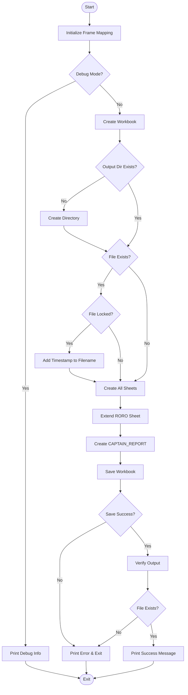
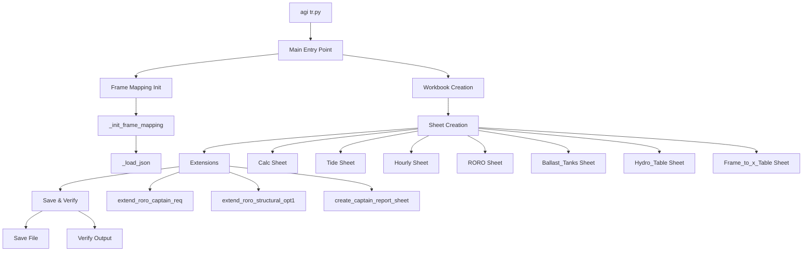
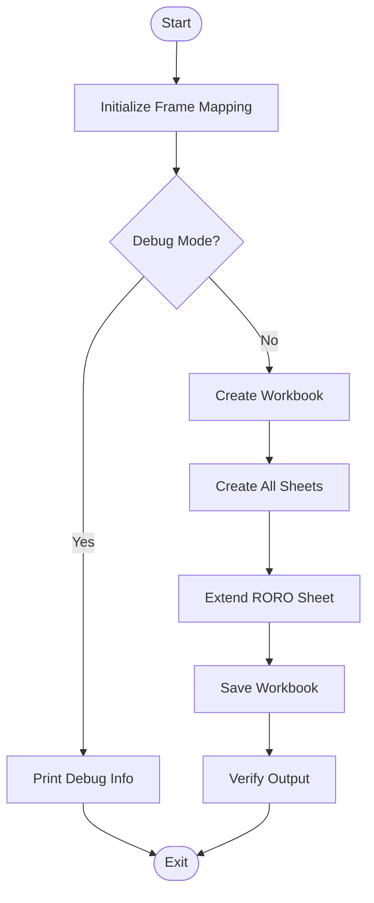
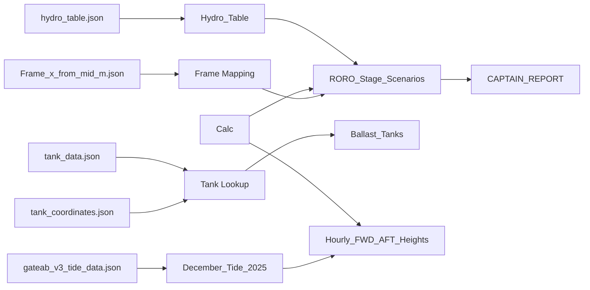
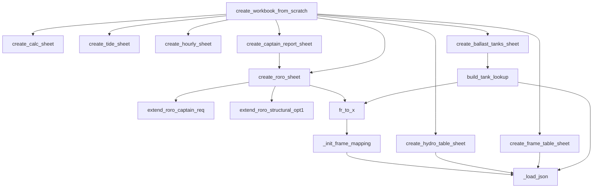
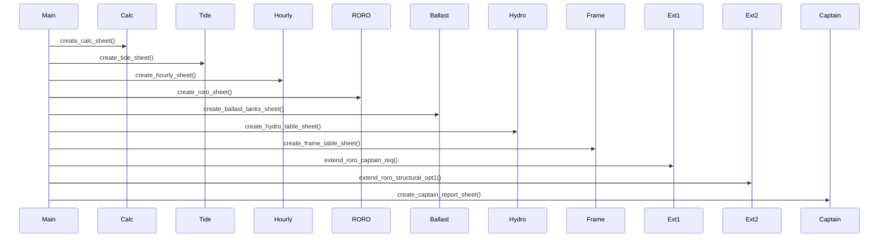
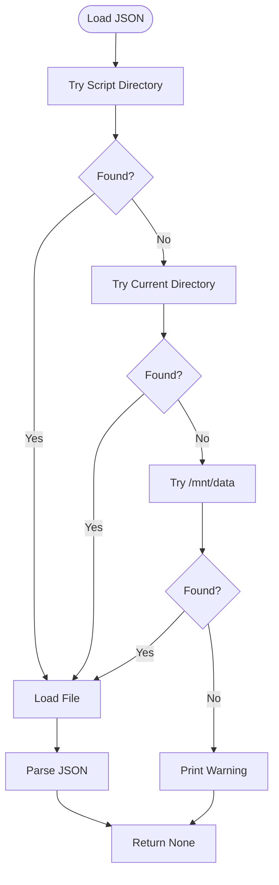
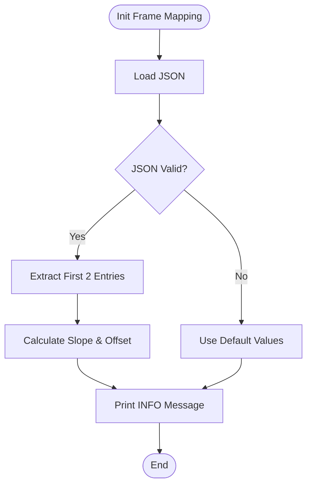
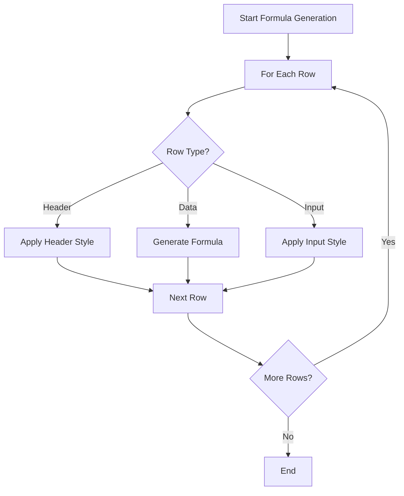

# Excel Generation Script - Algorithm, Logic, and Architecture

**Version:** 4.0.0 (DAS Method v4.3 Final Optimized & CAPTAIN_REPORT v4.3)
**Date:** 2025-11-19
**Related:**
- [EXCEL_GEN_01_OVERVIEW_AND_ARCHITECTURE.md](EXCEL_GEN_01_OVERVIEW_AND_ARCHITECTURE.md)
- [EXCEL_GEN_02_FUNCTIONS_AND_IMPLEMENTATION.md](EXCEL_GEN_02_FUNCTIONS_AND_IMPLEMENTATION.md)
- [EXCEL_GEN_03_MATHEMATICS_AND_DATA_FLOW.md](EXCEL_GEN_03_MATHEMATICS_AND_DATA_FLOW.md)

---

## Table of Contents

1. [Introduction](#1-introduction)
2. [Program Execution Flow](#2-program-execution-flow)
3. [Core Algorithms](#3-core-algorithms)
4. [System Architecture Diagrams](#4-system-architecture-diagrams)
5. [Logic Flow Details](#5-logic-flow-details)
6. [Design Patterns](#6-design-patterns)
7. [Algorithm Complexity](#7-algorithm-complexity)
8. [Error Handling Strategy](#8-error-handling-strategy)

---

## 1. Introduction

### 1.1 Purpose

This document provides a comprehensive analysis of the algorithms, logic flow, and system architecture of `agi tr.py`. It focuses on:

- **Algorithm Design**: Step-by-step algorithms for core operations
- **Logic Flow**: Decision trees, control flow, and execution paths
- **System Architecture**: Component relationships and data flow
- **Visualization**: Mermaid diagrams for different architectural views

### 1.2 Document Scope

This document complements the existing documentation by providing:

- **Algorithm-level details**: How operations are performed, not just what they do
- **Control flow analysis**: Decision points, branches, and execution paths
- **Architectural diagrams**: Visual representations of system structure
- **Design pattern identification**: Patterns used in the codebase

### 1.3 Relationship to Other Documentation

- **EXCEL_GEN_01**: High-level overview and architecture (text-based)
- **EXCEL_GEN_02**: Function-level implementation details
- **EXCEL_GEN_03**: Mathematical formulas and data flow
- **This Document**: Algorithm logic, control flow, and architectural diagrams

---

## 2. Program Execution Flow

### 2.1 Main Entry Point Algorithm

The program execution begins at the `if __name__ == "__main__":` block (lines 1665-1672).

**Algorithm**:
```
1. Initialize Frame Mapping
   - Call _init_frame_mapping()
   - Calculate _FRAME_SLOPE and _FRAME_OFFSET from JSON or use defaults

2. Check Command-Line Arguments
   - If "debug" argument provided:
     - Call debug_frame_mapping()
     - Print Frame mapping information
     - Exit (sys.exit(0))
   - Otherwise:
     - Call create_workbook_from_scratch()
```

**Implementation**: Lines 1665-1672

### 2.2 Execution Phases (8 Steps)

The main execution follows an 8-step process in `create_workbook_from_scratch()` (lines 1597-1662):

#### Phase 1: Initialization
- Print header banner
- Create output directory if needed
- Handle file conflicts (check if file is open)

#### Phase 2: Workbook Creation
- Create new Workbook object
- Remove default sheet

#### Phase 3: Sheet Creation (Sequential)
1. `create_calc_sheet()` - Parameter reference sheet
2. `create_tide_sheet()` - Tide data from JSON
3. `create_hourly_sheet()` - Hourly calculations (depends on Calc and Tide)
4. `create_roro_sheet()` - Stage scenarios (returns stages, first_data_row)
5. `create_ballast_tanks_sheet()` - Tank reference data
6. `create_hydro_table_sheet()` - Hydrostatic data (JSON-based)
7. `create_frame_table_sheet()` - Frame-to-x conversion table

#### Phase 4: RORO Sheet Extensions
- `extend_roro_captain_req()` - Add Captain Requirements columns (T-AD)
- `extend_roro_structural_opt1()` - Add Structural/Option 1/Ramp columns (AE-AV)

#### Phase 5: CAPTAIN_REPORT Sheet
- `create_captain_report_sheet()` - Summary sheet (depends on RORO sheet)

#### Phase 6: Save Workbook
- Save to file (with timestamp if original is locked)
- Handle save errors

#### Phase 7: Verification
- Check if file exists
- Print file size and sheet count

#### Phase 8: Success Message
- Print completion banner

### 2.3 Control Flow with Decision Points



### 2.4 Error Handling and Recovery

**Error Detection Points**:
1. **File Permission Error** (line 1613): File is open in Excel
   - **Recovery**: Generate timestamped filename
   - **User Feedback**: Print warning message

2. **Save Error** (line 1644): Disk full, permission denied, etc.
   - **Recovery**: Print error and exit with code 1
   - **User Feedback**: Error message with exception details

3. **Missing Output File** (line 1656): File not created after save
   - **Recovery**: Print error and exit with code 1
   - **User Feedback**: Error message

4. **JSON Loading Errors**: Handled in `_load_json()` and individual sheet creation functions
   - **Recovery**: Fallback to default values or empty data
   - **User Feedback**: Warning messages printed

---

## 3. Core Algorithms

### 3.1 Frame-to-x Coordinate Conversion Algorithm

**Purpose**: Convert Frame numbers to x-coordinates from midship using linear transformation.

**Algorithm**:
```
Input: Frame number (Fr)
Output: x-coordinate from midship (meters)

1. Load Frame mapping parameters:
   - If JSON file exists:
     a. Load data/Frame_x_from_mid_m.json
     b. Extract first two entries: (Fr1, x1), (Fr2, x2)
     c. Calculate slope: _FRAME_SLOPE = (x2 - x1) / (Fr2 - Fr1)
     d. Calculate offset: _FRAME_OFFSET = x1 - _FRAME_SLOPE * Fr1
   - Else:
     a. Use default values: _FRAME_SLOPE = 1.0, _FRAME_OFFSET = -30.15

2. Convert Frame to x:
   x = _FRAME_OFFSET + _FRAME_SLOPE * Fr

3. Return x
```

**Implementation**:
- Initialization: `_init_frame_mapping()` (lines 78-110)
- Conversion: `fr_to_x()` (lines 113-115)
- Inverse: `x_to_fr()` (lines 118-120)

**Complexity**: O(1) time, O(1) space

**Example**:
- Input: Fr = 52.5
- With defaults: x = -30.15 + 1.0 × 52.5 = 22.35 m

### 3.2 JSON Data Loading Algorithm

**Purpose**: Load JSON files with multiple path resolution and graceful fallback.

**Algorithm**:
```
Input: filename (relative or absolute path)
Output: Parsed JSON object or None

1. Define search paths (in order):
   a. Script directory (where agi tr.py is located)
   b. Current working directory
   c. /mnt/data (Notebook environment)

2. For each path:
   a. Construct full path: base_dir + filename
   b. Check if file exists
   c. If exists:
      - Open file with UTF-8 encoding
      - Parse JSON
      - Return parsed object
   d. If not exists, try next path

3. If all paths fail:
   a. Print warning: "[WARNING] {filename} not found → using fallback"
   b. Return None
```

**Implementation**: `_load_json()` (lines 52-70)

**Complexity**: O(n) time where n is number of search paths (typically 3), O(1) space

**Fallback Strategy**: Caller functions handle None return value by using default data or empty structures.

### 3.3 Tank Data Lookup Algorithm

**Purpose**: Merge tank data from multiple JSON sources with automatic property assignment.

**Algorithm**:
```
Input: None (uses global JSON files)
Output: Dictionary mapping tank names to properties

1. Load JSON files:
   a. Load tank_coordinates.json → coord_map
   b. Load tank_data.json → data_map

2. If either file missing:
   - Return empty dictionary {}

3. For each tank in coord_map:
   a. Extract Mid_Fr (Frame number)
   b. Convert to x_from_mid_m using fr_to_x(Mid_Fr)
   c. Get Weight_MT from data_map (preferred) or coord_map (fallback)
   d. Auto-assign SG based on tank name prefix:
      - "FWB*" → 1.025
      - "FWCARGO*" → 1.000
      - Others → 1.000
   e. Auto-assign air_vent_mm based on tank name prefix:
      - "FWB*" → 80 mm
      - "FWCARGO*" → 125 mm
      - Others → "" (empty)
   f. Store in lookup dictionary:
      {
          "x_from_mid_m": calculated_x,
          "max_t": weight_mt,
          "SG": assigned_sg,
          "air_vent_mm": assigned_air_vent
      }

4. Return lookup dictionary
```

**Implementation**: `build_tank_lookup()` (lines 145-191)

**Complexity**: O(n) time where n is number of tanks, O(n) space

**Auto-Assignment Rules**:
- **SG (Specific Gravity)**: Based on tank type (FWB = seawater, FWCARGO = fresh water)
- **Air Vent**: Based on tank type (FWB = 80mm, FWCARGO = 125mm)

### 3.4 Sheet Creation Algorithm

**Purpose**: Create Excel sheets with consistent structure, styling, and formulas.

**General Algorithm Pattern**:
```
For each sheet creation function:

1. Create sheet in workbook
2. Get styles dictionary
3. Create headers (if applicable)
   - Apply header font, fill, alignment, borders
4. Create data rows:
   - For each data row:
     a. Set cell values (data or formulas)
     b. Apply appropriate styles (normal, input, etc.)
     c. Set number formats
5. Set column widths
6. Apply special formatting (freeze panes, etc.)
7. Print success message
```

**Implementation**: All `create_*_sheet()` functions follow this pattern

**Variations**:
- **Calc Sheet**: Parameter definitions with sections
- **Tide Sheet**: JSON data loading with error handling
- **Hourly Sheet**: Formula generation for 744 rows
- **RORO Sheet**: Complex formulas with named ranges and Excel Table
- **Reference Sheets**: Simple data tables

### 3.5 Formula Generation Algorithm

**Purpose**: Generate Excel formulas dynamically based on row numbers and cell references.

**Algorithm Pattern**:
```
For each formula cell:

1. Determine formula type:
   - Reference (copy from another cell)
   - Calculation (mathematical operation)
   - Lookup (INDEX/MATCH, VLOOKUP)
   - Conditional (IF statements)
   - Validation (IF with OK/NG output)

2. Construct formula string:
   - Use f-string formatting with row numbers
   - Include absolute references ($) where needed
   - Include cross-sheet references (SheetName!Cell)
   - Include named ranges where applicable

3. Set cell value to formula string

4. Apply number format (if numeric result)

5. Apply appropriate style (normal, input, etc.)
```

**Formula Construction Examples**:

**Simple Reference**:
```python
ws.cell(row=row, column=21).value = f"=O{row_str}"
```

**Complex Calculation**:
```python
ws.cell(row=row, column=4).value = (
    f'=IF(OR(B{row_str}="", C{row_str}="", $C$9=""), "", '
    f'B{row_str} * (C{row_str} - $C$9))'
)
```

**Cross-Sheet Lookup**:
```python
ws.cell(row=row, column=20).value = (
    f'=IF(O{row_str}="", "", '
    f'VLOOKUP(AVERAGE(O{row_str},P{row_str}), Hydro_Table!$B:$D, 3, 1))'
)
```

**Implementation**: Used throughout all sheet creation functions, especially in:
- `create_hourly_sheet()` (lines 517-633): 7,440+ formulas
- `create_roro_sheet()` (lines 634-915): ~300 formulas
- `extend_roro_captain_req()` (lines 1082-1192): 11 columns × 12 rows
- `extend_roro_structural_opt1()` (lines 1194-1364): 15 columns × 12 rows

---

## 4. System Architecture Diagrams

### 4.1 High-Level System Architecture



### 4.2 Execution Flow Diagram



### 4.3 Data Flow Diagram



### 4.4 Function Dependency Graph



### 4.5 Sheet Creation Sequence



### 4.6 JSON Loading Algorithm



### 4.7 Frame Mapping Algorithm



### 4.8 Formula Generation Pattern



---

## 5. Logic Flow Details

### 5.1 Initialization Logic

**Frame Mapping Initialization** (lines 1668, 78-110):

1. **Trigger**: Called at program start in `if __name__ == "__main__":` block
2. **Process**:
   - Attempt to load `data/Frame_x_from_mid_m.json`
   - If successful and valid:
     - Extract first two entries
     - Calculate slope and offset
     - Print INFO message with calculated values
   - If failed:
     - Use default values (slope=1.0, offset=-30.15)
     - Print INFO message with default values
3. **Global State**: Sets `_FRAME_SLOPE` and `_FRAME_OFFSET` module-level variables

**Workbook Initialization** (lines 1619-1621):
- Create new Workbook object
- Remove default sheet (openpyxl creates one by default)

### 5.2 Sheet Creation Logic

**Sequential Creation with Dependencies**:

The sheet creation order is critical due to dependencies:

1. **Calc Sheet** (no dependencies)
   - Created first
   - Contains all parameters referenced by other sheets

2. **Tide Sheet** (depends on JSON file)
   - Loads data from absolute path
   - No sheet dependencies

3. **Hourly Sheet** (depends on Calc and Tide)
   - References Calc sheet parameters
   - References Tide sheet data
   - Must be created after both

4. **RORO Sheet** (depends on Calc)
   - References Calc sheet parameters
   - Uses Frame conversion functions
   - Returns `(stages, first_data_row)` for extensions

5. **Ballast_Tanks Sheet** (depends on JSON files)
   - Uses `build_tank_lookup()` which depends on Frame conversion
   - No sheet dependencies

6. **Hydro_Table Sheet** (depends on JSON file)
   - Loads from JSON or uses fallback
   - No sheet dependencies

7. **Frame_to_x_Table Sheet** (depends on JSON file)
   - Reference data only
   - No sheet dependencies

**Extension Pattern** (RORO Sheet):

After RORO sheet creation, it is extended in two phases:

1. **Captain Requirements** (columns T-AD)
   - Adds 11 columns for operational requirements
   - Uses `first_data_row` and `num_stages` for row range

2. **Structural/Option 1/Ramp** (columns AE-AV)
   - Adds 14 columns for structural validation (AS 컬럼 제거로 인한 조정)
   - Uses same row range parameters

**CAPTAIN_REPORT Sheet** (depends on RORO sheet):
- Created last
- References RORO sheet data
- Uses `stages` and `first_data_row` for row mapping

### 5.3 Formula Generation Logic

**Row-by-Row Formula Generation**:

For sheets with data rows (Hourly, RORO):

1. **Loop through rows**:
   ```python
   for row in range(start_row, end_row):
       row_str = str(row)
       # Generate formulas for this row
   ```

2. **Formula Types**:
   - **Direct formulas**: Mathematical calculations
   - **Conditional formulas**: IF statements with validation
   - **Reference formulas**: Copy from other cells
   - **Lookup formulas**: INDEX/MATCH, VLOOKUP

3. **Cell Reference Patterns**:
   - **Relative**: `B{row_str}` - Changes with row
   - **Absolute**: `$C$8` - Fixed cell
   - **Mixed**: `$A{row_str}` - Fixed column, relative row

4. **Cross-Sheet References**:
   - Format: `SheetName!CellReference`
   - Example: `Calc!$E$31`, `Hydro_Table!$B:$D`

**Conditional Formula Application**:

Many formulas include conditional logic:

```python
f'=IF(condition, true_value, false_value)'
```

Common patterns:
- **Empty check**: `IF(cell="", "", formula)`
- **Error check**: `IF(ISERROR(value), "", formula)`
- **Validation**: `IF(value <= limit, "OK", "NG")`

**Named Range Creation**:

Named ranges are created for formula simplification:

```python
wb.defined_names["MTC"] = DefinedName("MTC", attr_text="'RORO_Stage_Scenarios'!$C$8")
```

Used in formulas as: `MTC` instead of `'RORO_Stage_Scenarios'!$C$8`

### 5.4 Data Loading Logic

**JSON File Resolution**:

1. **Multi-Path Search**:
   - Try script directory first (most reliable)
   - Try current working directory (flexibility)
   - Try `/mnt/data` (Notebook environment)

2. **Format Detection**:
   - Parse JSON
   - Detect format (dict list vs array)
   - Convert if needed

3. **Fallback Chain**:
   - If JSON not found → Return None
   - Caller checks None and uses fallback data
   - Print warning message for user awareness

**Tide Data Loading** (absolute path):
- Uses fixed absolute path
- Always attempts to load
- Creates empty sheet if file missing

**Frame Mapping Data**:
- Optional JSON file
- Falls back to default values
- No error if missing

**Tank Data**:
- Two JSON files (coordinates + data)
- Merges data from both
- Falls back to hardcoded values

**Hydro_Table Data**:
- Optional JSON file (12 points)
- Falls back to 4 hardcoded points
- Supports both dict list and array formats

### 5.5 Extension Pattern Logic

**RORO Sheet Extension**:

The RORO sheet uses an extension pattern to add columns in phases:

1. **Base Sheet Creation**:
   - Creates sheet with core columns (A-S, 19 columns)
   - Returns `(stages, first_data_row)` tuple

2. **Extension Phase 1** (Captain Requirements):
   - Adds columns T-AD (11 columns)
   - Uses `first_data_row` and `num_stages` for row range
   - Auto-binds to stage count (v3.3.1)

3. **Extension Phase 2** (Structural/Option 1/Ramp):
   - Adds columns AE-AV (14 columns, AS 컬럼 제거로 인한 조정)
   - Uses same row range parameters
   - Auto-binds to stage count (v3.3.1)

**Benefits of Extension Pattern**:
- **Modularity**: Each extension is a separate function
- **Maintainability**: Easy to add/remove extensions
- **Flexibility**: Extensions can be conditional
- **Auto-binding**: Row ranges automatically adjust to stage count

---

## 6. Design Patterns

### 6.1 Template Method Pattern

**Pattern**: Sheet creation functions follow a common template with variations.

**Implementation**: All `create_*_sheet()` functions follow this structure:
1. Create sheet
2. Get styles
3. Create headers
4. Create data rows
5. Apply formatting
6. Print success message

**Example**: `create_calc_sheet()`, `create_tide_sheet()`, etc.

**Benefits**:
- Consistent structure across all sheets
- Easy to understand and maintain
- Clear separation of concerns

### 6.2 Strategy Pattern

**Pattern**: JSON loading uses multiple strategies (paths) with fallback.

**Implementation**: `_load_json()` tries multiple paths in order:
1. Script directory
2. Current working directory
3. `/mnt/data`

**Benefits**:
- Flexible file location
- Works in different environments
- Graceful degradation

### 6.3 Factory Pattern

**Pattern**: Style objects are created by a factory function.

**Implementation**: `get_styles()` returns a dictionary of pre-configured style objects.

**Benefits**:
- Centralized style management
- Consistent styling across sheets
- Easy to modify styles globally

### 6.4 Builder Pattern

**Pattern**: Formulas are constructed step-by-step using string building.

**Implementation**: Formula strings are built using f-strings with variables:
```python
ws.cell(row=row, column=4).value = (
    f'=IF(OR(B{row_str}="", C{row_str}="", $C$9=""), "", '
    f'B{row_str} * (C{row_str} - $C$9))'
)
```

**Benefits**:
- Dynamic formula generation
- Easy to modify formulas
- Supports complex formulas

### 6.5 Fallback Pattern

**Pattern**: Operations have fallback mechanisms when primary data source fails.

**Implementation**:
- JSON loading: Falls back to default values
- Frame mapping: Falls back to default slope/offset
- Hydro_Table: Falls back to 4 hardcoded points
- Tank data: Falls back to hardcoded values

**Benefits**:
- Robust error handling
- Graceful degradation
- User-friendly (no crashes)

---

## 7. Algorithm Complexity

### 7.1 Time Complexity Analysis

**Overall Execution**: O(n × m) where:
- n = number of sheets (8)
- m = average operations per sheet

**Frame Mapping Initialization**: O(1)
- Loads JSON (O(1) if file size is constant)
- Calculates slope/offset (O(1))

**JSON Loading**: O(p) where p = number of search paths (typically 3)
- Linear search through paths
- File I/O is O(1) per path

**Tank Lookup**: O(t) where t = number of tanks
- Iterates through tanks once
- Dictionary lookups are O(1)

**Sheet Creation**: O(r × c) where:
- r = number of rows
- c = number of columns
- For Hourly sheet: O(744 × 14) = O(10,416)
- For RORO sheet: O(12 × 45) = O(540)

**Formula Generation**: O(r × c)
- One operation per formula cell
- String construction is O(1) per formula

**Total Complexity**: O(n × r × c) where n is number of sheets with formulas

### 7.2 Space Complexity Analysis

**Workbook Object**: O(s × r × c) where:
- s = number of sheets (8)
- r = average rows per sheet
- c = average columns per sheet

**JSON Data**: O(d) where d = data size
- Tide data: 744 entries
- Frame data: 121 entries
- Tank data: ~20 entries
- Hydro data: 12 entries

**Lookup Dictionaries**: O(t) where t = number of tanks
- Tank lookup: ~8 entries
- Coordinate map: ~20 entries

**Total Space**: O(s × r × c + d + t)
- Dominated by workbook size
- Approximately 112 KB for final Excel file

### 7.3 Performance Considerations

**Optimizations**:
1. **Lazy Evaluation**: JSON files loaded only when needed
2. **Early Exit**: Debug mode exits immediately
3. **Batch Operations**: Formulas generated in loops
4. **Caching**: Styles dictionary created once and reused

**Bottlenecks**:
1. **File I/O**: JSON loading and Excel file saving
2. **Formula Generation**: 7,440+ formulas for Hourly sheet
3. **Memory**: Large workbook object in memory

**Scalability**:
- Current design handles 744 rows efficiently
- Adding more rows linearly increases time/space
- Adding more sheets has minimal impact

---

## 8. Error Handling Strategy

### 8.1 Error Detection Points

**File System Errors**:
1. **Missing Directory**: Detected at output directory creation
2. **File Locked**: Detected when trying to open existing file
3. **Save Failure**: Detected during workbook save operation
4. **Missing Output**: Detected during verification

**Data Loading Errors**:
1. **JSON Not Found**: Detected in `_load_json()`
2. **JSON Parse Error**: Detected during JSON parsing
3. **Missing Keys**: Detected when accessing dictionary keys
4. **Invalid Format**: Detected when validating data structure

**Formula Errors**:
1. **Invalid References**: Detected by Excel (not Python)
2. **Circular References**: Detected by Excel (not Python)
3. **Type Mismatches**: Detected by Excel (not Python)

### 8.2 Recovery Mechanisms

**File System Recovery**:
- **Missing Directory**: Create directory automatically
- **File Locked**: Generate timestamped filename
- **Save Failure**: Print error and exit (no recovery)
- **Missing Output**: Print error and exit (no recovery)

**Data Loading Recovery**:
- **JSON Not Found**: Return None, use fallback data
- **JSON Parse Error**: Return None, use fallback data
- **Missing Keys**: Use default values or skip entry
- **Invalid Format**: Use fallback data or empty structure

**User Feedback**:
- **Warnings**: Printed for non-critical issues (JSON not found)
- **Errors**: Printed for critical issues (save failure)
- **Info Messages**: Printed for successful operations

### 8.3 Error Handling Examples

**Example 1: JSON File Not Found**
```python
data = _load_json("data/hydro_table.json")
if data:
    # Use JSON data
else:
    # Use fallback data
    data = [[2991.25, 2.20, ...], ...]
```
**Recovery**: Uses fallback data, prints warning

**Example 2: File Locked**
```python
try:
    with open(OUTPUT_FILE, "r+b"):
        pass
except PermissionError:
    timestamp = datetime.now().strftime("%Y%m%d_%H%M%S")
    final_output_file = f"{base_name}_{timestamp}.xlsx"
```
**Recovery**: Creates new filename, prints warning

**Example 3: Save Failure**
```python
try:
    wb.save(final_output_file)
except Exception as e:
    print(f"  [ERROR] Failed to save: {e}")
    sys.exit(1)
```
**Recovery**: Prints error and exits (no recovery possible)

---

## Summary

This document provides a comprehensive analysis of the algorithms, logic flow, and system architecture of `agi tr.py`. Key points:

1. **Execution Flow**: 8-phase process with clear dependencies
2. **Core Algorithms**: 5 main algorithms with detailed descriptions
3. **Architecture**: 8 Mermaid diagrams showing different views
4. **Logic Flow**: Detailed analysis of initialization, sheet creation, formula generation, and data loading
5. **Design Patterns**: 5 patterns identified with examples
6. **Complexity**: Time and space analysis
7. **Error Handling**: Comprehensive error detection and recovery strategies

**Related Documentation**:
- [EXCEL_GEN_01_OVERVIEW_AND_ARCHITECTURE.md](EXCEL_GEN_01_OVERVIEW_AND_ARCHITECTURE.md) - High-level overview
- [EXCEL_GEN_02_FUNCTIONS_AND_IMPLEMENTATION.md](EXCEL_GEN_02_FUNCTIONS_AND_IMPLEMENTATION.md) - Function details
- [EXCEL_GEN_03_MATHEMATICS_AND_DATA_FLOW.md](EXCEL_GEN_03_MATHEMATICS_AND_DATA_FLOW.md) - Mathematical formulas

---

**End of Algorithm, Logic, and Architecture Document**

