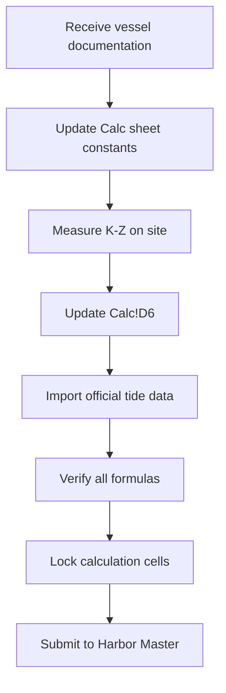

# LCT BUSHRA RORO Calculator - Patch 3 Technical Documentation

**Document Version:** 1.0  
**Date:** 2025-11-06  
**Project:** HVDC Transformer Transportation - Mina Zayed to DAS Island  
**Vessel:** LCT BUSHRA (64m Landing Craft)  
**Author:** MACHO-GPT / Samsung C&T Logistics Team  

---

## Executive Summary

Patch 3 represents a complete redesign of the RORO_Stage_Scenarios worksheet to address critical calculation errors and enhance operational safety validation. The primary focus is correcting the Ballast_t calculation formula, implementing Trim validation against naval architecture standards, and adding Length Between Perpendiculars (Lpp) as a key parameter.

### Critical Issues Resolved

| Issue ID | Description | Severity | Resolution |
|----------|-------------|----------|------------|
| RORO-001 | Ballast_time_h formula referenced wrong column (I→K) | **CRITICAL** | Corrected to reference L (Ballast_t) |
| RORO-002 | No validation for excessive trim conditions | **HIGH** | Added Trim_Check column with Lpp/50 criterion |
| RORO-003 | Missing Lpp parameter for trim calculations | **MEDIUM** | Added Calc!D16 (Lpp_m = 64.0m) |
| RORO-004 | Tide reference not clearly separated | **MEDIUM** | Added Tide_ref input (RORO!F4) |

---

## 1. System Architecture

### 1.1 Workbook Structure

```
LCT_BUSHRA_Package_RORO_FIXED.xlsx
├── Calc (Constants & Parameters)
│   ├── Input Constants (D4-D7)
│   ├── Operational Limits (D9-D11)
│   └── Stability Parameters (D13-D16)
├── December_Tide_2025 (Hourly Tide Data)
│   └── 744 timestamps (2025-12-01 to 2025-12-31)
├── Hourly_FWD_AFT_Heights (Trim-enabled Draft Calculator)
│   └── 11 columns × 744 rows
├── RORO_Stage_Scenarios (Stage-by-Stage Loading Analysis)
│   └── 14 columns × 13 stages
└── README (User Guide)
```

### 1.2 Data Flow Diagram

```
┌─────────────────┐
│  Calc Sheet     │
│  (Constants)    │◄─── User updates KminusZ, Lpp
└────────┬────────┘
         │ INDEX/MATCH
         ▼
┌─────────────────────────────────────────┐
│  RORO_Stage_Scenarios                   │
│  ┌────────────────────────────────┐    │
│  │ User Input: W_stage, x_stage   │    │
│  └───────────┬────────────────────┘    │
│              ▼                          │
│  ┌────────────────────────────────┐    │
│  │ TM = W × (x - LCF)             │    │
│  │ Trim_cm = TM / MTC             │    │
│  │ Trim_m = Trim_cm / 100         │    │
│  └───────────┬────────────────────┘    │
│              ▼                          │
│  ┌────────────────────────────────┐    │
│  │ Dfwd/Daft Calculation          │    │
│  │ Height Calculation             │    │
│  │ Ballast Requirement            │    │
│  └───────────┬────────────────────┘    │
│              ▼                          │
│  ┌────────────────────────────────┐    │
│  │ Trim_Check Validation          │    │
│  │ (|Trim| ≤ Lpp/50)              │    │
│  └────────────────────────────────┘    │
└─────────────────────────────────────────┘
```

---

## 2. Constants & Parameters (Calc Sheet)

### 2.1 Cell Mapping Reference

| Cell | Parameter | Value | Unit | Category | Update Required |
|------|-----------|-------|------|----------|-----------------|
| **D4** | L_ramp_m | 12.0 | m | Input | No |
| **D5** | theta_max_deg | 6.0 | deg | Input | No |
| **D6** | KminusZ_m | 3.0 | m | Input | **YES - Site measurement** |
| **D7** | D_vessel_m | 3.65 | m | Input | No (LCT Bushra actual depth, corrected from 4.85m) |
| **D9** | min_fwd_draft_m | 1.5 | m | Limit | No |
| **D10** | max_fwd_draft_m | 3.5 | m | Limit | No |
| **D11** | pump_rate_tph | 10.0 | t/h | Ops | No |
| **D13** | MTC_t_m_per_cm | 33.95 | t·m/cm | Stability | No (Bureau Veritas) |
| **D14** | LCF_m_from_midship | 32.41 | m | Stability | No |
| **D15** | TPC_t_per_cm | 7.5 | t/cm | Stability | No |
| **D16** | Lpp_m | 64.0 | m | Stability | **NEW in Patch 3** |

### 2.2 Parameter Definitions

#### 2.2.1 K-Z Distance (Calc!D6)
**Definition:** Vertical distance from Linkspan contact point (K) to Jetty reference datum (Z)

**Measurement Method:**
1. Position vessel parallel to jetty at mean tide
2. Measure from jetty deck to linkspan contact point
3. Account for vessel freeboard and tide height
4. Formula: K-Z = (Jetty_elevation) - (Contact_point_elevation)

**Critical Note:** This value MUST be updated with actual site measurement before operational use.

#### 2.2.2 Length Between Perpendiculars (Calc!D16)
**Definition:** Distance between forward and aft perpendiculars of vessel

**Usage in Patch 3:**
- Trim validation criterion: |Trim| ≤ Lpp/50
- For Lpp = 64m: Maximum acceptable trim = 1.28m
- Exceeding this limit triggers "EXCESSIVE" warning in Trim_Check column

---

## 3. RORO_Stage_Scenarios Sheet

### 3.1 Column Structure

| Col | Name | Type | Formula/Description | Validation |
|-----|------|------|---------------------|------------|
| **A** | Stage | Auto | "Stage 1" ~ "Stage 13" | - |
| **B** | W_stage_t | Input | Cargo weight (tonnes) | Must be > 0 |
| **C** | x_stage_m | Input | Position from midship (m) | Fwd: negative, Aft: positive |
| **D** | TM (t·m) | Calc | `=B{r}*(C{r}-$B$8)` | - |
| **E** | Trim_cm | Calc | `=D{r}/$B$7` | Check MTC ≠ 0 |
| **F** | Trim_m | Calc | `=E{r}/100` | - |
| **G** | Dfwd_m | Calc | `=$C$4 - F{r}/2` | Check range [1.5, 3.5] |
| **H** | Daft_m | Calc | `=$C$4 + F{r}/2` | Check range [1.5, 3.5] |
| **I** | FWD_Height_m | Calc | `=$E$8 - G{r} + $F$4` | Must be > 0 |
| **J** | AFT_Height_m | Calc | `=$E$8 - H{r} + $F$4` | Must be > 0 |
| **K** | Trim_Check | Calc | `=IF(ABS(F{r})<=($E$7/50), "OK", "EXCESSIVE")` | OK/EXCESSIVE |
| **L** | Ballast_t | Calc | `=ROUND(ABS(F{r})*50*$B$9, 2)` | Must be > 0 |
| **M** | Ballast_time_h | Calc | `=ROUND(L{r}/$B$10, 2)` | Must be < 168h |
| **N** | Notes | Input | Free text | - |

### 3.2 Key Formula Changes (Patch 3)

#### 3.2.1 Ballast_time_h (Column M) - CRITICAL FIX

**Previous (Incorrect):**
```excel
=IF(OR(I{r}="",OR($B$10="", $B$10=0)),"", ROUND(I{r}/$B$10, 2))
```
❌ **Problem:** Referenced column I (FWD_Height_m) instead of L (Ballast_t)

**Corrected (Patch 3):**
```excel
=IF(OR(L{r}="",OR($B$10="", $B$10=0)),"", ROUND(L{r}/$B$10, 2))
```
✅ **Solution:** Now correctly references column L (Ballast_t)

#### 3.2.2 Trim_Check (Column K) - NEW

**Formula:**
```excel
=IF(F{r}="","", IF(ABS(F{r})<=($E$7/50), "OK", "EXCESSIVE"))
```

**Logic:**
- Acceptable trim criterion: |Trim| ≤ Lpp/50
- For Lpp = 64m: Maximum = 1.28m
- Returns "OK" if within limit, "EXCESSIVE" if exceeded

**Operational Significance:**
- "EXCESSIVE" trim requires:
  1. Review by Chief Officer
  2. Additional ballast operations
  3. Possible cargo repositioning

---

## 4. Hourly_FWD_AFT_Heights Sheet

### 4.1 Trim Input Feature

**Column D (Trim_m):**
- Optional user input (yellow cells)
- Allows manual trim adjustment for specific hours
- If blank: Even-keel assumption (FWD = AFT)
- If filled: FWD ≠ AFT based on Trim value

### 4.2 Formula Dependencies

```
Dfwd_adj (E) = IF(Trim blank, Dfwd_req, Dfwd_req - Trim/2)
Daft_adj (F) = IF(Trim blank, Dfwd_req, Dfwd_req + Trim/2)

FWD_Height (I) = D_vessel - Dfwd_adj + Tide
AFT_Height (J) = D_vessel - Daft_adj + Tide
```

---

## 5. Validation & Quality Control

### 5.1 Pre-Operational Checklist

- [ ] **Calc!D6 (KminusZ_m)** updated with site measurement
- [ ] **December_Tide_2025!B2:B745** populated with official tide data
- [ ] **Source of tide data** documented (AD Ports/ADNOC)
- [ ] **RORO!C4 (Tmean_baseline)** verified against vessel's current draft
- [ ] **RORO!F4 (Tide_ref)** set to representative tide level
- [ ] All **W_stage_t** and **x_stage_m** values entered for loading stages
- [ ] **Trim_Check** column reviewed - no "EXCESSIVE" warnings

### 5.2 Formula Verification

**Sample Calculation (Stage 1):**

```
Given:
W_stage_t = 217 tonnes
x_stage_m = -5 m (forward of midship)
LCF = 32.41 m (aft of midship)
MTC = 33.95 t·m/cm
Tmean_baseline = 2.33 m
TPC = 7.5 t/cm
pump_rate = 10 t/h

Step 1: Trimming Moment
TM = W × (x - LCF)
TM = 217 × (-5 - 32.41)
TM = 217 × (-37.41)
TM = -8,118 t·m

Step 2: Trim
Trim_cm = TM / MTC
Trim_cm = -8,118 / 33.95
Trim_cm = -239.1 cm

Trim_m = -239.1 / 100
Trim_m = -2.391 m (negative = by stern)

Step 3: Drafts
Dfwd = Tmean - Trim/2
Dfwd = 2.33 - (-2.391/2)
Dfwd = 2.33 + 1.196
Dfwd = 3.53 m

Daft = Tmean + Trim/2
Daft = 2.33 + (-2.391/2)
Daft = 2.33 - 1.196
Daft = 1.13 m

Step 4: Trim Check
|Trim| = 2.391 m
Lpp/50 = 64/50 = 1.28 m
2.391 > 1.28 → EXCESSIVE ⚠️

Step 5: Ballast
Ballast_t = |Trim_m| × 50 × TPC
Ballast_t = 2.391 × 50 × 7.5
Ballast_t = 896.6 tonnes

Ballast_time = 896.6 / 10
Ballast_time = 89.7 hours
```

### 5.3 Error Handling

| Error Type | Cause | Resolution |
|------------|-------|------------|
| #DIV/0! | MTC or pump_rate = 0 | Check Calc sheet values |
| #REF! | Incorrect cell reference | Verify INDEX/MATCH formulas |
| Negative Height | Draft > (D_vessel + Tide) | Check input values |
| EXCESSIVE Trim | Cargo too far from LCF | Redistribute cargo |

---

## 6. INDEX/MATCH Dynamic Referencing

### 6.1 Implementation

All formulas use INDEX/MATCH instead of fixed cell references:

```python
def get_calc_value(param_name):
    return f'INDEX(Calc!$D:$D, MATCH("{param_name}", Calc!$B:$B, 0))'
```

**Example Usage:**
```excel
Instead of: =Calc!$D$13
Use: =INDEX(Calc!$D:$D, MATCH("MTC_t_m_per_cm", Calc!$B:$B, 0))
```

**Advantages:**
1. Robust to row insertions/deletions in Calc sheet
2. Self-documenting (parameter name visible in formula)
3. Easier to audit and maintain

---

## 7. Operational Workflow

### 7.1 Initial Setup (Pre-Mobilization)



### 7.2 RORO Loading Sequence

```
For each loading stage:
1. Enter W_stage_t (cargo weight)
2. Enter x_stage_m (cargo position)
3. Review calculated Trim_m
4. Check Trim_Check status
   - If OK: Proceed
   - If EXCESSIVE: Review cargo plan
5. Note Ballast_t and Ballast_time_h
6. Execute ballast operations
7. Verify final drafts
```

### 7.3 Hourly Draft Monitoring

```
During operations:
1. Check current tide from December_Tide_2025 sheet
2. Find corresponding row in Hourly_FWD_AFT_Heights
3. Review Status column (OK/CHECK)
4. If CHECK:
   - Verify actual drafts vs. calculated
   - Adjust ballast if needed
   - Document deviations in Notes column
```

---

## 8. Maintenance & Updates

### 8.1 Version Control

| Version | Date | Changes | Author |
|---------|------|---------|--------|
| 1.0 (Patch 1) | 2025-11-01 | Initial release | Team |
| 2.0 (Patch 2) | 2025-11-03 | Added Trim input to Hourly sheet | Team |
| 3.0 (Patch 3) | 2025-11-06 | Fixed RORO Ballast_time formula, added Trim_Check | MACHO-GPT |

### 8.2 Pending Enhancements

- [ ] Automated PDF report generation
- [ ] Integration with AIS for real-time tide data
- [ ] Visual dashboard for trim monitoring
- [ ] Multi-stage optimization algorithm
- [ ] Weather-tied operational windows

---

## 9. References

### 9.1 Technical Standards

- IMO Resolution A.749(18) - Code on Intact Stability
- IACS UR L5 - Longitudinal Strength Standard
- Bureau Veritas Rules for Steel Ships - Part B, Chapter 5

### 9.2 Project Documents

- LCT BUSHRA Stability Booklet (Bureau Veritas)
- Mina Zayed Port Regulations (AD Ports)
- HVDC Transformer Transport Plan (Samsung C&T)
- Linkspan Technical Specifications (Mammoet)

### 9.3 Contact Information

**Project Team:**
- Logistics Coordinator: [Name]
- Marine Operations: [Name]
- Harbour Master: Mina Zayed Port Authority

**Technical Support:**
- MACHO-GPT System: [Contact]
- Samsung C&T Logistics: [Contact]

---

## Appendix A: Formula Quick Reference

### A.1 RORO Calculations

```
TM = W × (x - LCF)
Trim_cm = TM / MTC
Trim_m = Trim_cm / 100
Dfwd = Tmean - Trim_m / 2
Daft = Tmean + Trim_m / 2
Ballast_t = |Trim_m| × 50 × TPC
Ballast_time_h = Ballast_t / pump_rate_tph
```

### A.2 Hourly Calculations

```
Dfwd_req = KminusZ + Tide - L_ramp × tan(theta_max)
Dfwd_adj = Dfwd_req - Trim / 2
Daft_adj = Dfwd_req + Trim / 2
Ramp_Angle = arctan((KminusZ - Dfwd_adj + Tide) / L_ramp)
FWD_Height = D_vessel - Dfwd_adj + Tide
AFT_Height = D_vessel - Daft_adj + Tide
```

---

## Appendix B: Troubleshooting Guide

### B.1 Common Issues

**Issue:** All RORO calculations show #DIV/0!
**Cause:** MTC (Calc!D13) or pump_rate (Calc!D11) is 0 or empty
**Solution:** Verify and correct these values in Calc sheet

**Issue:** Trim_Check always shows "EXCESSIVE"
**Cause:** Lpp (Calc!D16) not set or set too low
**Solution:** Confirm Lpp = 64m for LCT BUSHRA

**Issue:** Heights are negative
**Cause:** Draft > (D_vessel + Tide)
**Solution:** Check input values; vessel may be grounded or overloaded

**Issue:** Ballast_time unrealistic (>100h)
**Cause:** Excessive trim due to cargo position
**Solution:** Reposition cargo closer to LCF or use multiple stages

---

**Document End**

For questions or clarifications, contact the MACHO-GPT system or Samsung C&T Logistics Team.
